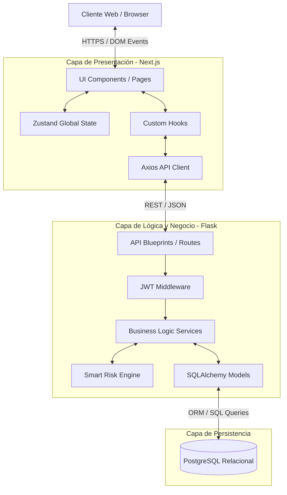
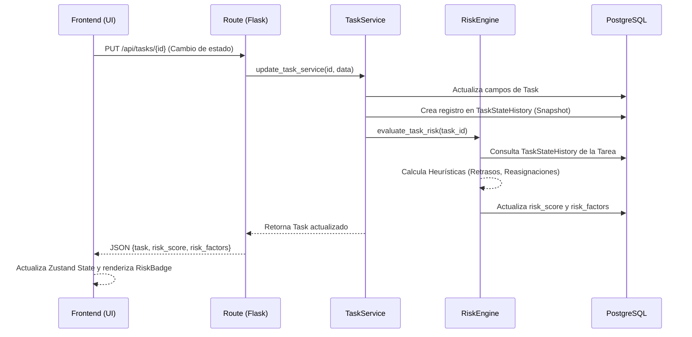

# Arquitectura del Sistema
## ProGest Smart Analytics

Este proyecto sigue una arquitectura **Cliente-Servidor (Client-Server Architecture)** tradicional con una clara separación de responsabilidades, acoplada a través de un contrato de API RESTful en formato JSON.

### 1. Vista de Alto Nivel (High-Level Architecture)

### 2. Capa de Presentación (Frontend)
El frontend está construido sobre **Next.js 16 (App Router)** utilizando **React 19**. Sin embargo, la aplicación se comporta principalmente como una SPA (Single Page Application) montada sobre la infraestructura de Next.js.
- **Renderizado:** Emplea de manera extensiva Client-Side Rendering (CSR) con directivas `"use client"` en casi todos los componentes interactivos.
- **Gestión de Estado (Zustand):** Se rechaza el uso de Context API en favor de tiendas atómicas de Zustand (ej. `useAuthStore`, `useDataStore`). Esto evita re-renderizados masivos en componentes hermanos.
- **Routing:** Utiliza el sistema de carpetas de Next.js (`/app/app/dashboard/page.tsx`).
- **Diseño UI:** Basado en **Radix UI** primitives y estilizado con **Tailwind CSS**. Se hace uso intensivo de composición y micro-componentes reutilizables.

### 3. Capa de Lógica de Negocio (Backend)
El backend está construido con **Python 3.x** utilizando **Flask**. La arquitectura de esta capa sigue el patrón **Service-Oriented Architecture (SOA)** a pequeña escala (patrón Controlador-Servicio).
- **Rutas (Controladores):** Los `blueprints` (ej. `task_routes.py`, `project_routes.py`) actúan únicamente como capas de transporte. Reciben la petición HTTP, parsean el JSON, invocan a la capa de servicios y retornan una respuesta HTTP serializada.
- **Servicios:** Contienen la lógica dura de la aplicación (`task_service.py`, `risk_engine_service.py`). Aquí se validan reglas de negocio, se emiten notificaciones y se dispara la telemetría.
- **Middlewares:** La validación de tokens JWT se realiza a través de decoradores `@jwt_required` inyectados en las rutas que lo ameritan.

### 4. Flujo de Datos y Telemetría

Una de las piezas arquitectónicas más importantes introducidas en ProGest es el **Flujo de Telemetría**.

### 5. Capa de Persistencia (Base de Datos)
La base de datos elegida es **PostgreSQL**.
La aplicación se comunica con la base de datos de manera exclusiva a través del ORM (Object-Relational Mapping) **Flask-SQLAlchemy**.
Las migraciones de esquemas (cambios en tablas, creación de campos nuevos) son gestionadas por **Alembic** vía **Flask-Migrate**.

### 6. Relaciones Clave del Negocio
- Un Usuario (`User`) puede pertenecer a múltiples Proyectos (`Project`) mediante la tabla intermedia `Membership`.
- Un Proyecto posee múltiples Tareas (`Task`) y múltiples Ciclos Iterativos (`Sprint`).
- Las Tareas están ligadas a un `Sprint`.
- Cada Tarea tiene un historial de cambios (`TaskStateHistory`) el cual es la materia prima para el cálculo del motor de riesgo.
