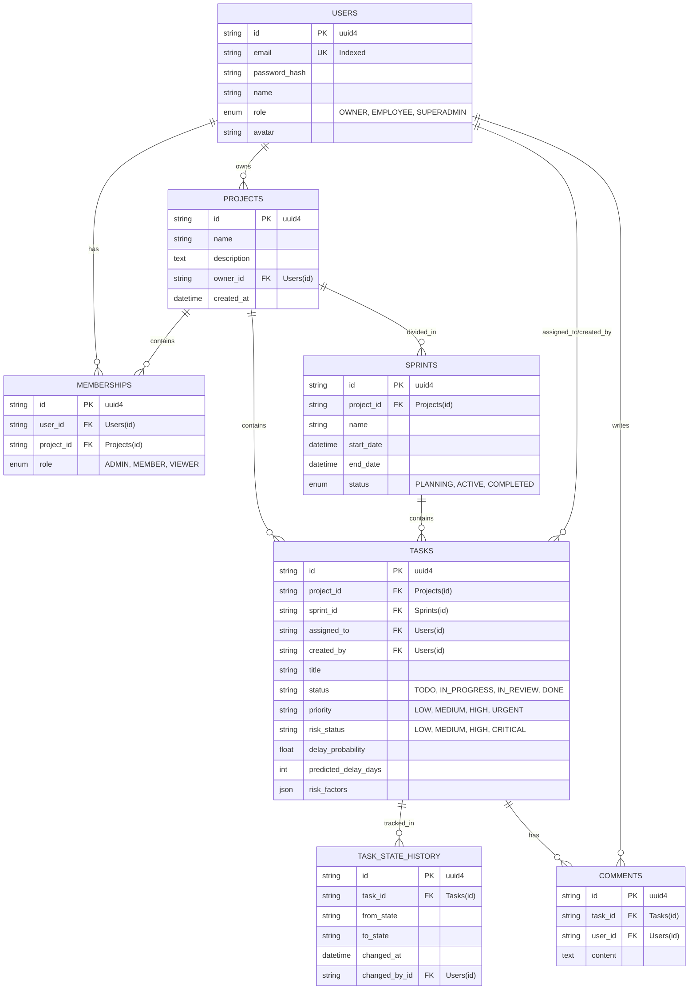

# Arquitectura de Base de Datos
## ProGest Smart Analytics

Este documento detalla la capa de persistencia relacional implementada en PostgreSQL y mapeada a través de SQLAlchemy.

### 1. Modelo Entidad-Relación (ER Diagram)

A continuación se detalla la estructura principal de tablas y sus relaciones.

### 2. Análisis de Tablas Principales

#### `tasks`
El núcleo transaccional. Además de los campos estándar (título, descripción, fechas), incorpora las columnas predictivas añadidas en el Sprint 2:
- `risk_status`: Nivel de riesgo calculado (ENUM semántico).
- `delay_probability`: Porcentaje (0.0 a 1.0) de probabilidad de fracaso.
- `predicted_delay_days`: Entero estimativo de desviación cronológica.
- `risk_factors`: Columna JSON que almacena un array de strings (las razones matemáticas del riesgo, ej. "Exceso de reasignaciones").

#### `task_state_history` (Telemetría)
La tabla más importante para el Smart Risk Engine.
Es de solo inserción (Append-only). Nunca se edita un registro aquí.
- Graba cada transición en la máquina de estados de la tarea (ej. de `TODO` a `IN_PROGRESS`).
- `changed_at` provee un timestamp absoluto, permitiendo calcular métricas como el *Time-in-State* (Tiempo estancado en una columna).

#### `memberships`
Tabla intermedia (Join Table) que resuelve la relación muchos a muchos entre `users` y `projects`, añadiendo el atributo de `role`. Es vital para los middlewares de autorización.

### 3. Índices y Rendimiento
Para evitar *Table Scans* durante consultas críticas, SQLAlchemy tiene configurados `index=True` explícitamente en:
- `User.email` (Login rápido).
- `Task.project_id`, `Task.sprint_id`, `Task.assigned_to` (Consultas de tableros).
- `TaskStateHistory.task_id` (Cálculo rápido del Risk Engine).

### 4. Migraciones
El proyecto utiliza Alembic. Esto significa que los comandos DDL (`CREATE TABLE`, `ALTER TABLE`) no se ejecutan directamente en la BD, sino que Alembic lee las diferencias entre los Modelos (código Python) y el Schema actual de Postgres, generando archivos de revisión en `migrations/versions/`.
