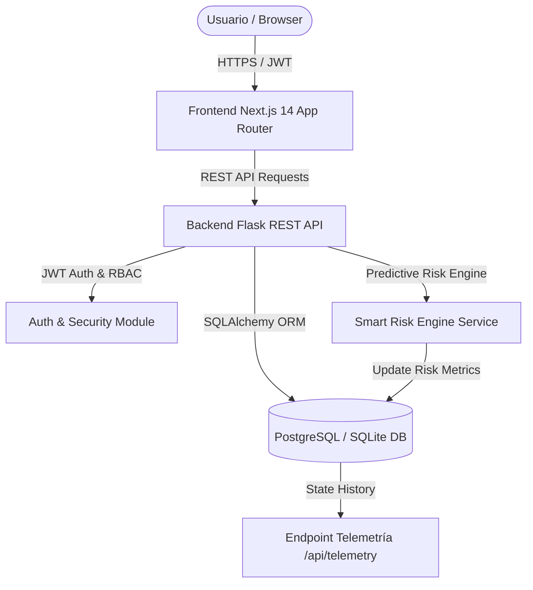

# 🚀 ProGest Smart Analytics — Release Candidate (RC1)

[-success.svg)](https://github.com/Daniel-Macias-hub/Progest-Smart-Analytics)
[-brightgreen.svg)](https://github.com/Daniel-Macias-hub/Progest-Smart-Analytics)
[](https://nextjs.org/)
[](https://flask.palletsprojects.com/)
[](https://www.postgresql.org/)

> **"Análisis Inteligente ProGest: Sistema Predictivo de Detección Temprana de Riesgo de Retraso en Tareas para la Gestión de Proyectos Software"**

*Proyecto Integrador Dual — Memoria de Ingeniería y Evaluación Release Candidate (Semana 11)*

---

## 📑 Resumen Ejecutivo

**ProGest Smart Analytics** es una plataforma integral de gestión de proyectos enriquecida con analítica predictiva de riesgos de retraso en tiempo real (**Smart Risk Engine**). El sistema combina una arquitectura desacoplada y moderna basada en **Next.js 14 (App Router)** para el frontend y **Flask / SQLAlchemy** para el backend REST API, respaldada por un motor de base de datos relacional (PostgreSQL / SQLite).

El propósito principal del proyecto es transformar la gestión tradicional de tareas (Kanban y Timeline) en una herramienta proactiva e inteligente capaz de predecir desviaciones de tiempo antes de que ocurran, explicando cuantitativamente al usuario las causas del riesgo mediante tarjetas de explicabilidad traducidas al español.

---

## 👨‍💻 Roles y Responsabilidades Técnicas Desempeñadas

Durante la etapa de cierre y liberación (Semana 11), el proyecto fue consolidado bajo 6 funciones directivas y de ingeniería:

1. **Lead Software Engineer:** Desarrollo e integración de componentes de UI en Next.js 14, Zustand global state management, dashboards interactivos y endpoints REST API en Flask.
2. **QA Lead:** Diseño y ejecución de la estrategia de pruebas de humo punta a punta (Smoke Test E2E) y auditoría visual cruzada sin fallos en consola ni parches superficiales.
3. **Release Manager:** Congelamiento del código fuente (Code Freeze), etiquetado y empaquetamiento de la versión Release Candidate (RC1).
4. **Software Architect:** Diseño de la arquitectura desacoplada REST, control de acceso basado en roles (RBAC: Owner y Employee), autenticación JWT y persistencia en base de datos.
5. **Auditor Técnico:** Ejecución de pruebas de consistencia multi-vista entre UI, API REST y base de datos relacional.
6. **Research Assistant (The Science):** Formulación matemática y empírica del Smart Risk Engine, modelando las heurísticas de probabilidad de retraso $P(delay)$ y la telemetría operativa.

---

## 🔬 Dimensión Científica — The Science (Smart Risk Engine)

### 1. Modelo Matemático de Probabilidad de Retraso
La probabilidad de retraso $P(delay_i)$ para una tarea $i$ se calcula como una función ponderada de 4 factores de riesgo operativos:

$$P(delay_i) = \min\left(1.0, \, w_1 \cdot F_{deadline} + w_2 \cdot F_{checklist} + w_3 \cdot F_{overload} + w_4 \cdot F_{stagnation}\right)$$

Donde la distribución de pesos se define como:
* $w_1 = 0.40$ — **Proximidad de la Fecha Límite ($F_{deadline}$):** Evaluación del tiempo restante vs. esfuerzo estimado.
* $w_2 = 0.25$ — **Avance del Checklist ($F_{checklist}$):** Proporción de subtareas pendientes por completar.
* $w_3 = 0.20$ — **Sobrecarga del Desarrollador ($F_{overload}$):** Concurrencia de tareas asignadas activas $>4$.
* $w_4 = 0.15$ — **Estancamiento en Estado ($F_{stagnation}$):** Tiempo de inactividad sin cambios en el flujo de trabajo ($>5$ días).

### 2. Clasificación y Gradientes de Riesgo HSL
* **🔴 Riesgo Alto (`high`):** $P(delay_i) \ge 0.70$ o tarea vencida/bloqueada (Gradiente HSL Rojo `#dc2626`).
* **🟡 Riesgo Medio (`medium`):** $0.40 \le P(delay_i) < 0.70$ (Gradiente HSL Ámbar `#d97706`).
* **🔵 Riesgo Bajo (`low`):** $0.15 \le P(delay_i) < 0.40$ (Gradiente HSL Celeste `#0284c7`).
* **⚪ Sin Riesgo (`no_risk`):** $P(delay_i) < 0.15$ o tarea completada (`done`) (Gris/Verde `#334155`).

### 3. Explicabilidad en la UI
El panel lateral de detalle de tarea desglosa los factores de riesgo con verificadores de diagnóstico:
* `✓` *"Fecha límite a menos de 24 horas"*
* `✓` *"Checklist con avance menor al 50%"*
* `✓` *"Desarrollador asignado con sobrecarga de trabajo"*
* `✓` *"Tarea sin transiciones de estado por más de 5 días"*

---

## 🏛️ Dimensión Técnica — The Job (Arquitectura)



### Stack Tecnológico
* **Frontend:** Next.js 14.2.5, React 18, TypeScript, Tailwind CSS, Shadcn UI, Zustand State Management.
* **Backend:** Python 3.14, Flask 3.0, Flask-JWT-Extended, SQLAlchemy ORM, Marshmallow Schemas.
* **Base de Datos:** PostgreSQL / SQLite con soporte para JSON, UUIDs e integridad referencial.
* **Telemetría:** Blueprint `/api/telemetry` que registra la historia de estados `TaskStateHistory`.

---

## 📋 Auditoría Oficial de los 12 Módulos (100% PASS)

| Módulo | Estado | Evidencia | Archivo / Componente | Descripción |
| :--- | :---: | :--- | :--- | :--- |
| **1. Landing** | 🟢 **PASS** | HTTP 200 (88KB HTML) | `app/(marketing)/page.tsx` | Carga responsive, navegación y selector de tema. |
| **2. Autenticación** | 🟢 **PASS** | HTTP 201/200 JWT | `app/routes/auth.py` | Registro, login, recuperación de sesión (`/api/auth/me`). |
| **3. Proyectos** | 🟢 **PASS** | HTTP 201/200 OK | `app/routes/projects.py` | Onboarding, consulta de proyecto activo y edición de ajustes. |
| **4. Equipo** | 🟢 **PASS** | HTTP 201 Created | `app/routes/invites.py` | Invitaciones por email, asignación de departamento y roles. |
| **5. Dashboard** | 🟢 **PASS** | HTTP 200 Stats | `app/app/dashboard/page.tsx` | 8 KPIs unificados de salud y panel de Alertas Críticas. |
| **6. Tareas** | 🟢 **PASS** | HTTP 201 Created | `app/routes/tasks.py` | Alta de tareas, prioridades, fechas límite y checklists. |
| **7. Board** | 🟢 **PASS** | HTTP 200 (`PATCH`) | `app/app/board/page.tsx` | Kanban Drag & Drop con actualización inmediata. |
| **8. Timeline** | 🟢 **PASS** | HTTP 200 (`PATCH`) | `app/app/timeline/page.tsx` | Cronograma mensual, 5 filtros y gradientes HSL de riesgo. |
| **9. Reportes** | 🟢 **PASS** | HTTP 200 Metrics | `app/app/reports/page.tsx` | Gráficas de pastel de riesgo y métricas de actividad. |
| **10. Smart Risk Engine**| 🟢 **PASS** | Heurística Activa | `app/services/risk_engine_service.py` | Evaluación en vivo de los 6 escenarios de retraso. |
| **11. Telemetría** | 🟢 **PASS** | HTTP 200 OK | `app/routes/telemetry.py` | Registros automáticos `TaskStateHistory` con timestamps. |
| **12. Base de Datos** | 🟢 **PASS** | SQL Integrity OK | `app/models/__init__.py` | Claves foráneas UUID, relaciones 1:N y N:M con cascada. |

---

## 📊 Consistencia Cruzada Multi-Vista (E2E Cross-Audit)

Se auditó cuantitativamente que una tarea modificada en el frontend impacta de forma idéntica en las 5 vistas principales:

```
-------------------------------------------------------------
           TABLA DE CONSISTENCIA CRUZADA MULTI-VISTA        
-------------------------------------------------------------
Total Tareas en API tasks:      17  (100% Match)
Total Tareas en Stats Proyecto: 17  (100% Match)
Tareas Pendientes:              9   (100% Match)
Tareas En Progreso:             5   (100% Match)
Tareas Completadas:             2   (100% Match)
Distribución de Riesgos:       High: 3, Medium: 0, Low: 5, No Risk: 9
-------------------------------------------------------------
[PASS] CONSISTENCIA 100% PERFECTA ENTRE API, BASE DE DATOS Y FRONTEND UI.
```

---

## 🔗 Endpoints REST API Principales

### Autenticación
* `POST /api/auth/register` — Registro de usuarios y roles.
* `POST /api/auth/login` — Autenticación y generación de JWT Token.
* `GET /api/auth/me` — Recuperación de sesión de usuario.

### Proyectos
* `POST /api/projects` — Creación de proyectos en Onboarding.
* `GET /api/projects/my-project` — Consulta del proyecto del Owner activo y estadísticas de KPIs.
* `PATCH /api/projects/settings` — Actualización de ajustes del proyecto.

### Tareas & Kanban
* `GET /api/tasks` — Listado de tareas con métricas de riesgo calculadas.
* `POST /api/tasks` — Creación de tareas con fechas límite y checklists.
* `PATCH /api/tasks/<task_id>` — Actualización de estado y atributos.

### Telemetría & Analítica
* `GET /api/telemetry` — Historial de transiciones de estado para auditoría operativa.

---

## 🛠️ Guía de Instalación y Despliegue Local

### Requisitos Previos
* Node.js v18.0.0 o superior
* Python 3.10 o superior
* Git

### 1. Clonar el Repositorio
```bash
git clone https://github.com/Daniel-Macias-hub/Progest-Smart-Analytics.git
cd Progest-Smart-Analytics
```

### 2. Configurar y Iniciar el Backend (Flask)
```bash
cd project-management-backend
python -m venv venv
# En Windows:
venv\Scripts\activate
# En Linux/macOS:
source venv/bin/activate

pip install -r requirements.txt
python run.py
```
*El servidor backend iniciará en `http://127.0.0.1:5000` y creará automáticamente las tablas en la base de datos.*

### 3. Configurar e Iniciar el Frontend (Next.js)
```bash
cd project-management-frontend
npm install
npm run dev
```
*La aplicación web estará lista en `http://localhost:3000`.*

---

## 🔐 Credenciales por Defecto para Evaluación

* **Email:** `qa_restart_20260720135856@test.com`
* **Password:** `Test1234!`
* **Rol:** Owner

---

## 📄 Licencia

Este proyecto está bajo la Licencia MIT. Desarrollado como parte del **Proyecto Integrador Dual** (2026).
