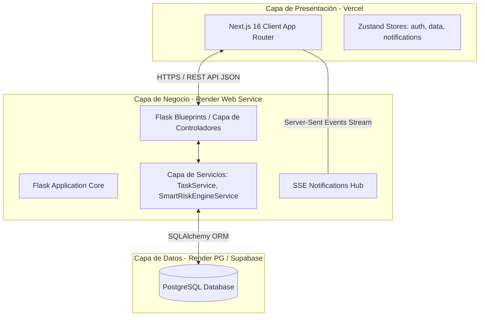
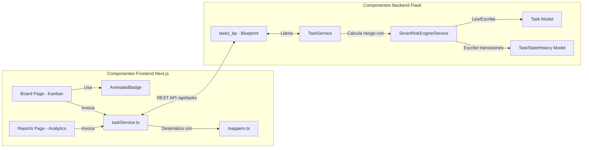
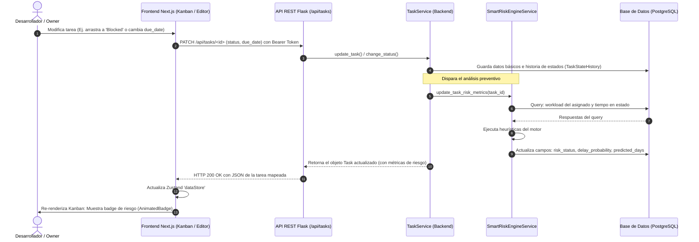

# ESPECIFICACIÓN DE ARQUITECTURA DE SOFTWARE - SPRINT 2
## ProGest Smart Analytics (Semana 6)

Este documento especifica la arquitectura final, el modelo de datos extendido, los componentes y los flujos operacionales del módulo **Smart Risk Engine** para el sistema **ProGest Smart Analytics**.

***

## 1. DIAGRAMA DE ARQUITECTURA GENERAL

El sistema opera bajo un esquema cliente-servidor físicamente distribuido y desacoplado, diseñado para el despliegue optimizado en la nube.



***

## 2. DIAGRAMA DE COMPONENTES

Detalle de la descomposición modular de software en cliente y servidor, mostrando cómo interactúan los componentes para soportar la detección de riesgos.



***

## 3. MODELO ENTIDAD-RELACIÓN (ER) ACTUALIZADO
Esquema lógico de datos que incorpora las tablas y campos necesarios para el motor de riesgos y la telemetría histórica.

```mermaid
erDiagram
    users {
        string id PK
        string email UNIQUE
        string password_hash
        string name
        string role "OWNER, EMPLOYEE, SUPERADMIN"
        string avatar
        string status "active, disabled"
        datetime created_at
    }

    projects {
        string id PK
        string name
        string owner_id FK
        string status
        boolean sprint_enabled
        integer tasks_retention_days
        datetime created_at
    }

    memberships {
        string id PK
        string user_id FK
        string project_id FK
        string role
        string status
        datetime joined_at
    }

    sprints {
        string id PK
        string project_id FK
        string name
        string status "planned, active, closed"
        datetime start_date
        datetime end_date
    }

    tasks {
        string id PK
        string project_id FK
        string sprint_id FK
        string title
        string description
        string status "pending, in_progress, in_review, blocked, done"
        string priority "low, medium, high, urgent"
        string assigned_to FK
        string created_by FK
        datetime due_date
        datetime start_date
        datetime completed_at
        json checklist
        string risk_status "no_risk, low, medium, high"
        float delay_probability
        integer predicted_delay_days
        json risk_factors
        datetime created_at
        datetime updated_at
    }

    task_state_histories {
        string id PK
        string task_id FK "CASCADE"
        string from_state "Nullable"
        string to_state
        datetime changed_at
        string changed_by_id FK "SET NULL"
    }

    %% Relaciones
    users ||--o| projects : "posee (1:1)"
    users ||--o{ memberships : "pertenece"
    projects ||--o{ memberships : "contiene"
    projects ||--o{ tasks : "agrupa"
    projects ||--o{ sprints : "planifica"
    sprints ||--o{ tasks : "contiene"
    users ||--o{ tasks : "tiene asignadas"
    tasks ||--o{ task_state_histories : "registra telemetría"
    users ||--o{ task_state_histories : "cambia estado"
```

***

## 4. DIAGRAMA DEL FLUJO DE CÁLCULO DE RIESGO
Muestra el recorrido completo del dato: desde que ocurre una acción en la UI hasta la actualización proactiva de indicadores visuales.



***

## 5. DECISIONES DE DISEÑO Y ESTRATEGIA DE DESPLIEGUE

### 5.1 Decisiones de Diseño Arquitectónico
1. **Heurísticas Deterministas vs. Inteligencia Artificial (ML):**
   * Para la fase inicial, se optó por un motor de reglas heurísticas paramétricas. Esto reduce la complejidad computacional en el servidor, elimina la necesidad de datasets masivos iniciales (falsos positivos iniciales) y asegura un comportamiento determinista fácil de auditar por el profesor.
2. **Cálculo síncrono controlado (Flush & Recalculate):**
   * Para evitar la complejidad de colas de tareas asíncronas de Python (como Celery/Redis) que incrementarían los costos de infraestructura, el motor corre dentro del ciclo de vida de la petición de Flask tras persistir los cambios (`db.session.flush()`). Las consultas están altamente optimizadas mediante índices en la base de datos para no sobrecargar el hilo.
3. **Desacoplamiento de Negocio (Service Layer):**
   * La lógica del motor de riesgo se mantiene completamente separada de las rutas HTTP (`app/routes`) y reside exclusivamente en `SmartRiskEngineService`, permitiendo realizar pruebas unitarias automatizadas rápidas sobre SQLite sin levantar el servidor HTTP.

### 5.2 Estrategia de Despliegue en la Nube
El monorepo está estructurado de manera que las dos aplicaciones principales puedan construirse y distribuirse de forma independiente:

* **Frontend (Capa de Presentación):**
  * **Plataforma:** **Vercel**.
  * **Ventajas:** Soporte nativo para Next.js App Router, optimización automática de imágenes y scripts, distribución global en la red Edge y facilidades para variables de entorno de producción.
  * **Integración:** GitHub webhook que despliega automáticamente cada commit fusionado en la rama `main`.

* **Backend (Capa de Negocio):**
  * **Plataforma:** **Render (Web Service)**.
  * **Configuración:** Entorno nativo de Python (`render.yaml`). El comando de construcción instala los requerimientos (`pip install -r requirements.txt`) y levanta el servidor usando Gunicorn con threads dinámicos (`render-start.sh`).

* **Base de Datos (Capa de Datos):**
  * **Plataforma:** **Render PostgreSQL** (o **Supabase PostgreSQL** en caso de requerir escalabilidad y control de respaldos superior).
  * **Conectividad:** SQLAlchemy ORM utiliza la variable de entorno `DATABASE_URL` provista de forma segura por el servidor de despliegue. Las migraciones incrementales se aplican durante el despliegue automático del backend llamando a `flask db upgrade` en el script de arranque.
