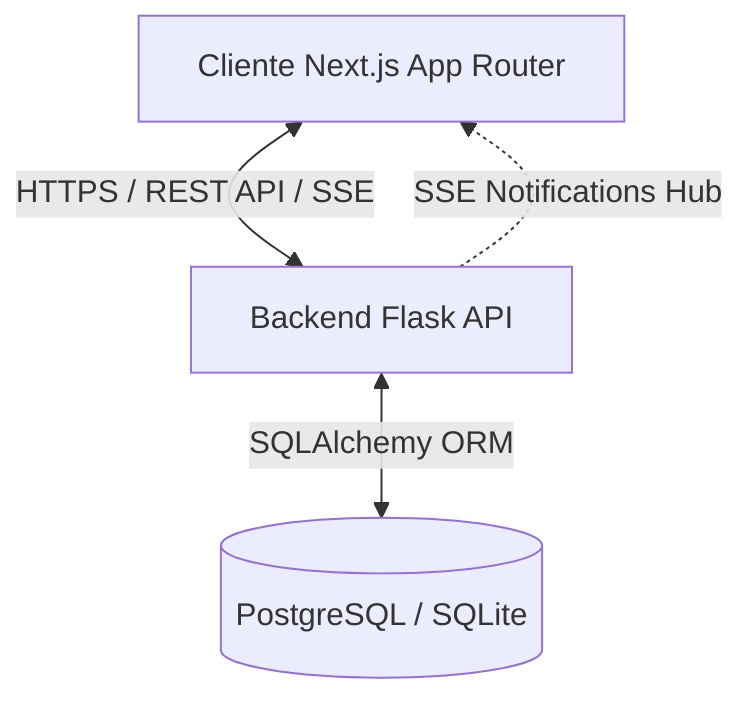
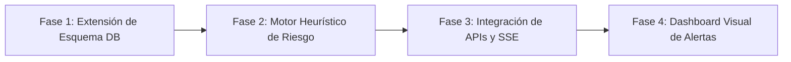

# AUDITORÍA TÉCNICA DEL SISTEMA BASE (PROGEST)
## Preparación para la Transición a ProGest Smart Analytics (Sprint 2)

***

## 1. RESUMEN DE LA ARQUITECTURA ACTUAL

El sistema ProGest está construido bajo un patrón cliente-servidor clásico desacoplado, diseñado para operar bajo un esquema multitenant básico.

### 1.1 Frontend (Next.js 16)
* **Framework:** Next.js 16 (React 19) estructurado bajo el directorio `app` (App Router).
* **Gestión de Estado:** Zustand para stores de cliente ligeros y reactivos (`authStore`, `dataStore`, `notificationStore`, `uiStore`).
* **Estilizado y UI:** Tailwind CSS v4, componentes basados en Radix UI (estilo shadcn) y animaciones avanzadas implementadas con GSAP, Framer Motion y Anime.js.
* **Componentes de Visualización:** Recharts para gráficos de métricas y `@dnd-kit` para el tablero Kanban interactivo.
* **Comunicación:** Cliente HTTP personalizado (`api.ts`) que maneja de forma centralizada los tokens JWT, la inyección del header `Authorization` y los mappers de tipos entre el formato JSON del backend y el estado del frontend.

### 1.2 Backend (Flask)
* **Framework:** Flask modularizado a través de `Blueprints` para separar los contextos funcionales de la API REST.
* **ORM:** Flask-SQLAlchemy para la definición de modelos y transacciones con la base de datos.
* **Esquemas de Validación:** Marshmallow para serialización, deserialización y validación estricta de las peticiones HTTP (`schemas`).
* **Capa de Servicios:** Capa intermedia de lógica de negocio (`services`) para desacoplar las rutas HTTP (`routes`) de la manipulación de base de datos.
* **Notificaciones en Tiempo Real:** Implementación nativa de Server-Sent Events (SSE) a través del `notifications_hub.py` para notificaciones "push" reactivas en el navegador.

### 1.3 Autenticación y Autorización
* **Mecanismo:** JSON Web Tokens (JWT) gestionados en el backend mediante `Flask-JWT-Extended`.
* **Configuración:** Token de acceso con expiración corta (2 horas) y token de refresco (7 días) para seguridad continua.
* **Roles del Sistema:**
  * `OWNER`: Creador del proyecto, tiene privilegios administrativos completos (creación de tareas, edición de sprints, invitaciones de equipo, asignaciones).
  * `EMPLOYEE`: Miembro del equipo, con permisos restringidos para actualizar el estado de las tareas asignadas, marcar ítems de su checklist y chatear.
  * `SUPERADMIN`: Rol global para administración de la plataforma SaaS (sin proyecto asignado).

### 1.4 Base de Datos y Modelos
* **Motor:** PostgreSQL en producción y soporte de SQLite local para desarrollo y pruebas automatizadas.
* **Migraciones:** Administrado por `Flask-Migrate` (Alembic) para cambios incrementales de esquema.
* **Modelos Principales:**
  * `User`: Credenciales, avatar, rol e información complementaria de perfil del empleado (departamento, habilidades, turno).
  * `Project`: Configuración del tenant (zona horaria, formato de fecha, retención de tareas, configuración de Sprints).
  * `Membership`: Tabla intermedia asociativa entre `User` y `Project` con estatus (`active`, `pending`, `removed`).
  * `Task`: Tareas de trabajo con estados (`pending`, `in_progress`, `in_review`, `blocked`, `done`), prioridad (`low`, `medium`, `high`, `urgent`), fechas límite y asignado.
  * `Sprint`: Sprints con estados (`draft`, `active`, `closed`).
  * `Notification` y `Comment`: Tablas de soporte a la colaboración y auditoría.
  * `TeamMessage`: Soporte para el chat de equipo en tiempo real vinculado opcionalmente a tareas.

***

## 2. AUDITORÍA DETALLADA DE COMPONENTES

| Componente | Estado Actual | Potencial de Reutilización | Modificaciones Requeridas para Smart Analytics |
| :--- | :--- | :--- | :--- |
| **Autenticación** | Implementada con JWT. Los tokens expiran de forma segura. | **Alta (95%)** | Ninguna en la base de autenticación. Solo validar que el rol `OWNER` tenga acceso al panel de control del Smart Risk Engine. |
| **Gestión de Proyectos** | Configurable, soporta sprints opcionales y retención de datos. | **Alta (90%)** | Agregar banderas de configuración para habilitar/deshabilitar el motor de alertas tempranas de riesgo de tareas. |
| **Modelos de Tareas (`Task`)** | Estructura estándar. Checklist guardado en formato JSON en base de datos. | **Media (60%)** | Modificar tabla `tasks` para almacenar métricas predictivas de riesgo (ej: `risk_score`, `delay_probability`, `risk_status`). |
| **Servicio de Tareas (`TaskService`)** | Centraliza la creación, edición y validación del checklist de tareas. | **Media (50%)** | Integrar llamadas al motor de riesgo en cada cambio significativo de tarea (cambio de fecha límite, checklist modificado, estancamiento en estado). |
| **Dashboard Actual** | Muestra contadores de tareas por estado en tarjetas animadas. | **Media (40%)** | Agregar un widget de estado de riesgos (tareas en riesgo alto, probabilidad media de retraso del sprint). |
| **API REST (`/api/tasks`)** | CRUD de tareas y actualizaciones parciales. | **Alta (80%)** | Exponer campos predictivos de riesgo en las respuestas de Marshmallow y habilitar filtros por nivel de riesgo. |

***

## 3. ANÁLISIS DE FORTALEZAS, DEBILIDADES Y RIESGOS

### 3.1 Fortalezas
1. **Separación de Responsabilidades:** El uso claro de la capa de servicios (`app/services`) permite inyectar la lógica del Smart Risk Engine sin contaminar las rutas de la API.
2. **Sistema de Tiempo Real Funcional:** La infraestructura existente de Server-Sent Events (SSE) es ideal para notificar instantáneamente al `OWNER` cuando una tarea entra en estado de "Riesgo Crítico".
3. **UI Moderna y Modulable:** La interfaz Next.js tiene un catálogo robusto de componentes estilizados con animaciones fluidas, facilitando la creación de interfaces de visualización de riesgos estéticas y profesionales.

### 3.2 Debilidades
1. **Checklist no estructurado:** Al guardar el checklist como un bloque JSON en la tarea (`tasks.checklist`), es más difícil medir el progreso incremental histórico de subtareas de manera granular para modelos analíticos sin deserializar todo el campo.
2. **Falta de Historial de Estados:** La base de datos actual no registra los cambios de estado de una tarea con marca de tiempo precisa (solo registra `created_at` y `updated_at` a nivel de registro). Para calcular métricas de riesgo (ej: cuello de botella, tiempo de ciclo), necesitamos una tabla histórica de transiciones de estado.
3. **Falta de registro de horas estimadas vs reales:** No existen columnas de "esfuerzo estimado" (story points o tiempo estimado) en el modelo de tareas, lo que limita la capacidad del motor de predecir retrasos basados en velocidad real vs estimada.

### 3.3 Riesgos Técnicos
1. **Sobrecarga en la Base de Datos:** Si el cálculo heurístico de riesgo se ejecuta sincrónicamente en cada petición de actualización de tareas, puede degradar el tiempo de respuesta del servidor (bloqueando el backend).
2. **Falsos Positivos de Riesgo:** Algoritmos heurísticos demasiado sensibles podrían generar alertas excesivas (fatiga por alertas) en los usuarios, reduciendo la credibilidad del Smart Risk Engine.
3. **Compatibilidad de SQLite:** Durante pruebas locales, SQLite no soporta nativamente ciertas operaciones de tipo JSON y ALTER TABLE complejas de PostgreSQL de la misma manera, lo que requiere código defensivo o de compatibilidad en migraciones.

***

## 4. PLAN DE EVOLUCIÓN HACIA PROGEST SMART ANALYTICS

Para integrar el **Smart Risk Engine** de forma limpia y profesional, seguiremos un plan ordenado en 4 fases de desarrollo para el Sprint 2:

### Fase 1: Extensión del Esquema de Datos y Telemetría (Backend)
1. **Tabla de Transición de Estados (`task_state_history`):**
   * Crear un nuevo modelo para registrar cuándo cambió una tarea de estado, quién lo cambió y cuánto tiempo permaneció en él.
2. **Columnas de Metadatos de Riesgo en `tasks`:**
   * Agregar campos para persistir los cálculos del motor sin necesidad de recalcular en cada consulta:
     * `risk_status`: Enum (`no_risk`, `low`, `medium`, `high`).
     * `delay_probability`: Float (`0.0` a `1.0`).
     * `predicted_delay_days`: Integer.
     * `risk_factors`: JSON (ej: `{"workload": true, "due_date_proximity": true}`).
3. **Creación de la Migración:** Generar scripts utilizando Alembic para garantizar la actualización segura de las tablas en producción.

### Fase 2: Desarrollo del Motor Heurístico de Riesgo (Servicios Backend)
1. **Creación de `SmartRiskEngineService`:**
   * Desarrollar el algoritmo heurístico de evaluación de riesgo basado en:
     * Proximidad de la fecha límite (`due_date`).
     * Velocidad del checklist (ítems completados vs restantes y tiempo restante).
     * Carga de trabajo del asignado (tareas simultáneas activas).
     * Historial de estados (estancamiento en `in_progress` o transiciones repetitivas a `blocked`).
2. **Ejecución Asíncrona/Semi-Asíncrona:** Diseñar el servicio para que el cálculo se invoque mediante disparadores ligeros al cambiar una tarea, asegurando que no bloquee la respuesta HTTP principal.

### Fase 3: Integración de API, SSE y Alertas en Tiempo Real
1. **Actualización de Schemas Marshmallow:** Permitir que los campos de riesgo se incluyan de forma limpia en el payload JSON de la API de tareas.
2. **Eventos SSE de Riesgo:** Integrar el motor con `NotificationService` and `notifications_hub` para lanzar notificaciones de sistema audibles y visuales cuando el nivel de riesgo de una tarea aumente a `high` o `urgent`.

### Fase 4: Dashboard Visual y Visualización de Telemetría (Frontend Next.js)
1. **Panel de Control de Riesgos:**
   * Crear una vista interactiva de riesgos en `/app/reports` o una subruta dedicada.
   * Utilizar gráficos de Recharts para mostrar tendencias de riesgo por sprint y cuellos de botella de la velocidad del equipo.
2. **Indicadores de Riesgo en Kanban (`board`):**
   * Modificar las tarjetas de tareas del tablero Kanban para incluir pequeños badges animados (`AnimatedBadge`) que cambien de color según el estado del riesgo.
3. **Notificaciones Proactivas:** Integrar alertas emergentes con `sonner` en la interfaz del usuario.
